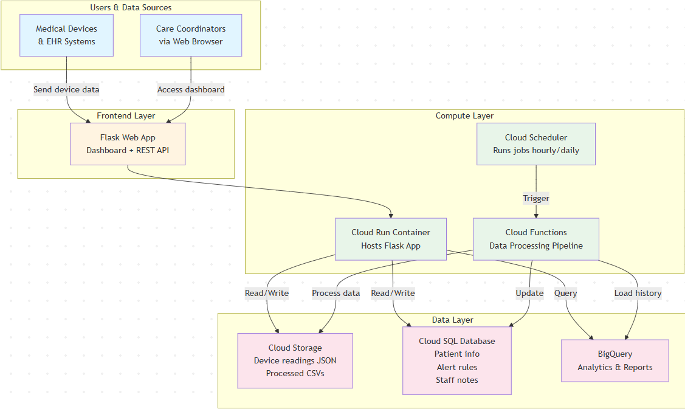

## Diagram

## 1. Service Mapping

|Layer|Service|Role|Related Module|
|---|---|---|---|
|Storage|Cloud storage|To store raw device readings, processed aggregates CSVs, alert output files, patient demographic files, and organized in folders by patient ID and date.|Module 6 - Storage|
|Compute - Web|Cloud run|The flask web application that serves the dashboard UI and REST API endpoints.|Module 3 - Compute|
|Compute - Processing|Cloud functions|The serverless data processing pipeline is ingest function polls device APIs every 15 minutes, aggregation runs hourly to calculate trends and summaries, and alert function evaluate rules and generate notifications.|Module 5 - Serverless|
|Orchestration|Cloud Scheduler|Trigger the cloud functions on scheduled intervals, manages the automated data pipeline workflow.|Module 5 - Serverless|
|Database|Cloud SQL|Store structural relational data and supports transactional queries from Flask app.|Module 7 - Databases - Relational|
|Analytics|BigQuery|Data warehouse for historical analytics and reporting, enables fast aggregation queries for weekly reports and trend analysis.|Module 7 - Databases - Relational|

## 2. Data Flow Narrative

- Step 1: Data ingestion which is every 15 minutes the cloud scheduler triggers the ingestion cloud function, it will function polls as an external device manufacturer APIs for any new patient readings. It will validate JSON payloads and write raw JSON files to cloud storage and publishing any new message.
- Step 2: Data processing, the message would trigger the aggregation cloud function and these functions would scan cloud storage for all of the readings the past 24 hours on each patient. The queries cloud sql retrieve patient specific alerts from table, writes summarized CSV, loads detailed reading, and publishes complete message.
- Step 3: Alert generation, a message triggers the alert engine cloud function it reads patients latest patient summary CSV from storage. The queries table will retrieve clinical decision rules and evaluate each patient. It will write alerts to CSV file, store the alerts in BigQuery table and log them all to cloud logging for an audit trail.
- Step 4: Dashboard access, a care coordinator will open the web browser and navigate to the cloud run url, a dashboard page will load what today's alert CSV to cloud storage. A displayed interactive table is showing all patients with status indicators, when clicking on a patient, a flask queries generates a chart and staff documents an intervention and the flask will write a cloud sql table.
- Step 5: Weekly reporting, a cloud scheduler triggers the reporting cloud function and the function queries BigQuery will aggregate metrics across all of the patients the past week. The metrics would be total alerts generated, number of interventions by type, patient compliance rate, and average response time from an alert to intervention. The summaries report CSV will be generated and stored, updating cloud sql table for dashboard.

## 3. Security, Identity, and Governance Basics

All the service credentials and API keys are managed from using the google cloud secret manager, that is never stored in configuration files or in code. The flask application that gets run on the cloud run uses a workload identity that is used to authenticate other gcp services without needing a service account key files. Then with external API keys they are stored and accessed at runtime from the secret manager API with appropriate IAM permissions. There is also environment variables in the cloud run and cloud functions secret versions so the database connection strings will use cloud sql proxy for any encrypted connections and all of the secrets will automatic rotation policies enabled which will access log in cloud audit logs. For Identity and Access Management (IAM) it follows the principle of least privilege, the care coordinators will authenticate from google identity platform with read access to patient dashboards and write access only to intervention notes. The cardiologists have read only access to the data plus additional analytics reports. The clinical administrators will manage patient enrollment and the configure alert thresholds, service accounts are scoped narrowly and with the ingestion function on raw data bucket only while the aggregation function has raw and processed data. For VPC service controls it will create a perimeter around the gcp project which will prevent data exfiltration and API endpoints will require authentication with flask implement role based access control middleware so they can enforce permissions at the application layer. To avoid exposing Protected Health Information (PHI) in public environments, this system operates entirely within HIPAA - compliant gcp environment with a Business Associate Agreement (BAA) in place. The data that is at rest is encrypted using google managed or customer managed encryption keys, the patient identifiers will use medicasl record numbers (MRNs) instead of names in file paths and API calls where possible. On development and testing the use of synthetic/de-identified datasets ensuring no real patient data exists in a non-production environments. The production data will never leave the gcp security perimeter, a comprehensive audit logging tracks all the data access with cloud audit logs retained for 7 years. Data retention policies will delete patient data after 2 years unless more care is required. For access to production environments it requires a multi-factor authrntication.

## 4. Cost and Operational Considerations

The storage costs will be minimal for the application the cloud storage pricing is approximately $0.20 per GB per month and the JSON files averaging 2 KB per reading. Additionally the compute costs are highly favorable with serverless cloud run charges only when handling requests at a certain charge and cloud functions are similarly economical, 2,880 ingestion calls/month and 750 processing/alert calls would be at a minimal charge per month and the cloud scheduler is $0.10 per job per month. A total estimated monthly cost would be around $8 to $10 for a fully functional system or $20 to $30 if you add redundancy and if we were to scale to 500 patients. To have costs be kept to a minimal during developement and learning, we leverage serverless first architecture the cloud run scales to zero when it is unused, the cloud functions execute only when triggered, and cloud scheduler minimal per job fee will make it more economical than running a VM 24/7. For learning purposes we can replace cloud sql with BigQuery entirely since its free tier is more generous but this can sacrifice transactional integrity for cost savings and for notifications we will use SendGrid free tier instead of having premium services. During the development, we are implementing aggressive data lifecycle policies by deleting raw JSON files 7 days once processed and limit BigQuery table partitions to 30 days. The most important things used is resource labels and budget alerts to monitor spending and shut down resources if cost spikes unexpectedly to ensure the project remains financially viable. 